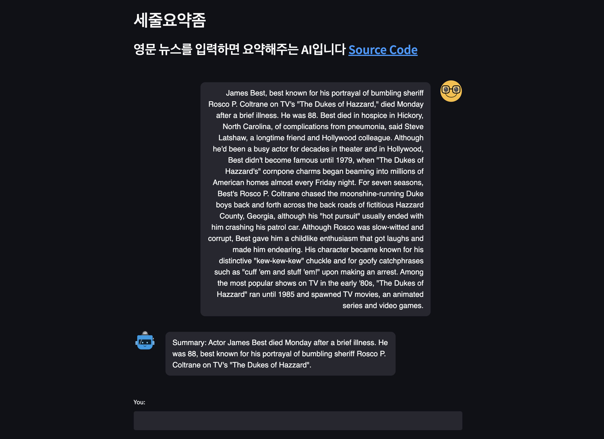

# SJYYJ



## Get Started

```bash
python -m venv .venv
pip install -r requirements-dev.lock
python -m spacy download en_core_web_sm
# Install pytorch
```

## Source Code Structure

`web.py` is for web gui, `main.py` is for cli.

- `web.py` use `main.py`
- `main.py` use `src/summary.py`
- `src/summary.py` use `src/extract.py`, `src/rank.py` and `src/abstract.py`

### `.env` Example

Running OpenIE server is needed for SJYYJ to work. You should make a `.env` file in the root

```bash
OPENIE_URL='http://localhost:8000'
```

## Run CLI

```bash
docker compose up
python main.py file 'data/cnn/article.txt'
python main.py text 'I made arrangements pick up her dog'
```

## Run GUI

```bash
docker compose up
streamlit run web.py
```

## Develop Experience
- Formatter - `Autopep8`
- Typing - `Mypy`
- Linter - `Pylint` (recommended)
