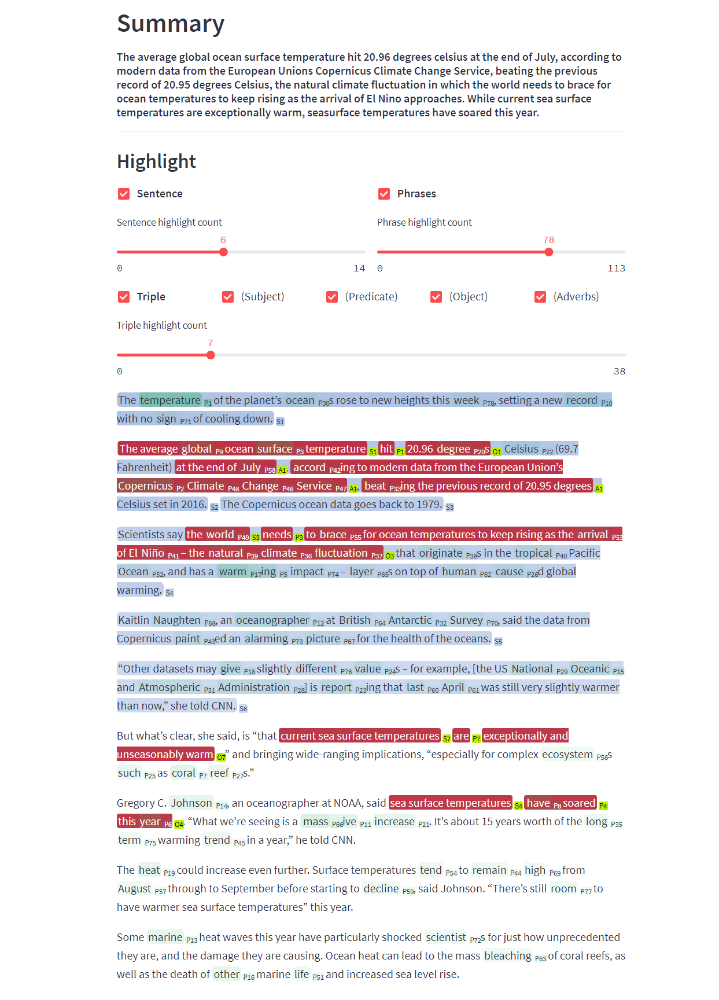
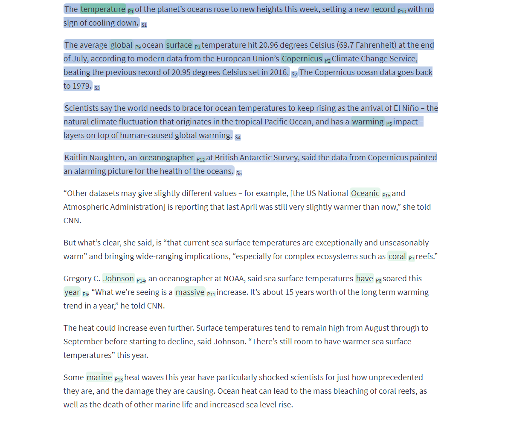

# SJYYJ

AI summarization algorithm which can **highlight the important part** of the article.



It decompose sentences into triple and decomposing sentences into smaller units and recomposing them with the most important information. We integrated the concept of **Knowledge Graph and Relation triple** into summarization AI by **combining extractive summarization and abstractive summarization**.

## Get Started

This project are using [rye](https://mitsuhiko.github.io/rye/) (recommended)

```zsh
rye sync
python -m spacy download en_core_web_sm
```

## Source Code Structure

`web.py` is for web gui, `main.py` is for cli.

- `web.py` use `main.py`
- `main.py` use `src/summary.py`
- `src/summary.py` use `src/extract.py`, `src/rank.py` and `src/abstract.py`

### `.env` Example

Running OpenIE server is needed for SJYYJ to work. You should make a `.env` file in the root
OpenIE server requires around 10GB of RAM to run.

```zsh
OPENIE_URL='http://localhost:8000'
```

## Run CLI

```bash
docker-compose up --scale openie5=4 -d
pm2 start web/service.py --interpreter python3
python main.py file 'data/cnn/article.txt'
python main.py text 'I made arrangements pick up her dog'
```

## Run GUI

```bash
docker compose up
streamlit run web/simple.py
```

### GUI Demo

Inline visualization using highlighting. Red is for relation triple, blue is for sentence, and green is for phrase word.




## Develop Experience

- Formatter - `Autopep8`
- Typing - `Mypy`
- Linter - `Pylint` (recommended)
